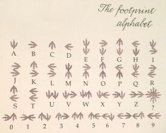

# Hackerlab2019 – Ancient language ?

* **Categorie:** Crypto
* **Points:** 300

## Challenge
>C'est un language connu des ancêtres des cyber-amazones.
[chal.png](chal.png)

## Solution
Après quelques recherches sur google, nous avons découvert qu'il s'agit de l'[Alphabet de l'Empreinte](https://dinotopia.fandom.com/wiki/Footprint_alphabet).

Le Flag est : `CTF RESPECT`
