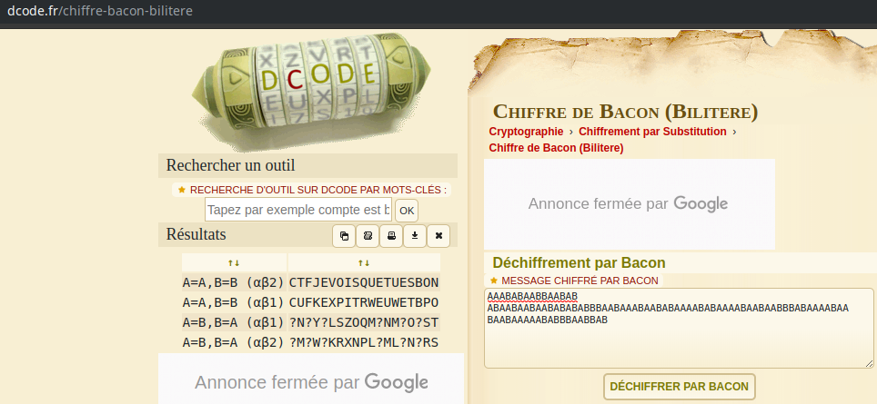

# Hackerlab2019 –  ?

* **Categorie:**
* **Points:**

## Challenge
>Les cyber-amazones sont tombées sur un code très ingénieux qu'ils doivent déchiffrer. Apporte leur aussi ton expertise.
[a_decode.txt](a_decode.txt)

## Solution
En affichant le contenu du fichier <b>a_decode.txt</b>, nous avions remarquer que le contenu a été encoder avec l'algorithm [Bacon](https://en.wikipedia.org/wiki/Bacon%27s_cipher).

En effet, le chiffre de Bacon (ou bilitère) utilise un alphabet de substitution en remplaçant les caractères par des groupes de 5 formés avec deux lettres, généralement A et B.

Nous nous sommes référé à  l'outil en ligne [dcode](https://www.dcode.fr/chiffre-bacon-bilitere) afin de décoder le contenu du message.

Bingo, nous avions pu obtenir le flag : `CTFJEVOISQUETUESBON`
