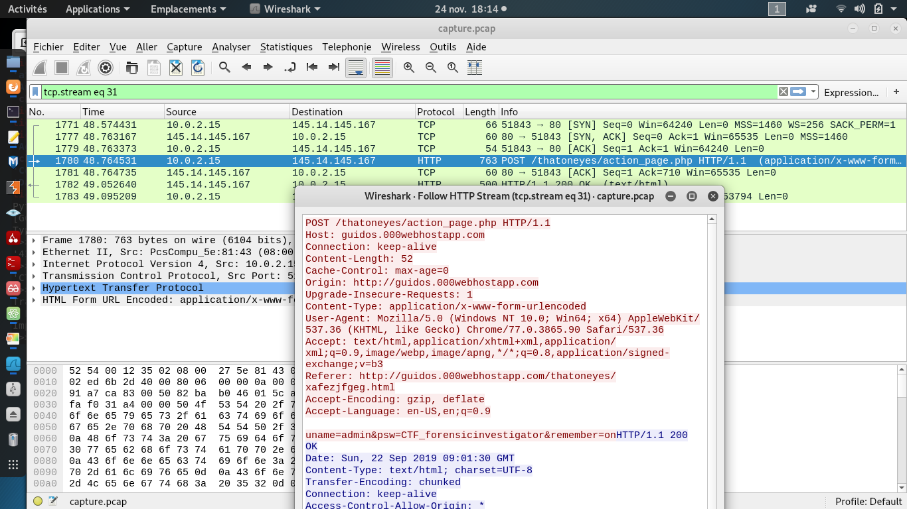

# Hackerlab2019 – Insecure protocol ?

* **Categorie:** Forensic
* **Points:** 150

## Challenge
[capture.pcap](capture.pcap)

## Solution
Après avoir téléchargé le fichier capture.pcap, nous l'avons ouvert avec l'outil wireshark.

Nous avions commencé par analyser les trames des protocoles courants. Après le DNS, en analysant le protocole HTTP, une requête POST tire notre aimable attention.

Le flag est : `CTF_forensicinvestigator`
