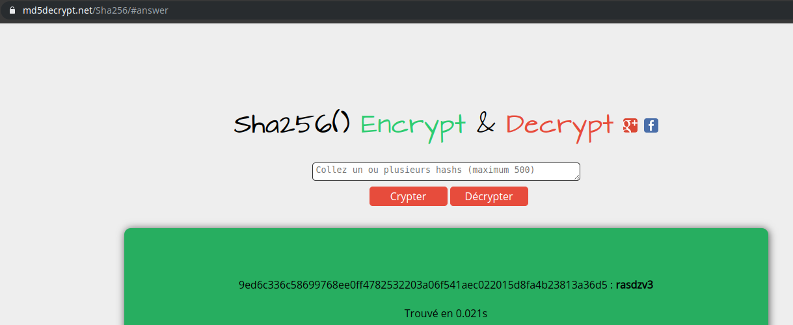

# Hackerlab2019 – Bad practice ?

* **Category:** Miscellaneous
* **Points:** 150

## Challenge

>En respectant les règles d'hygienes informatique, on ne devrait pas être amenés à faire ca
>9ed6c336c58699768ee0ff4782532203a06f541aec022015d8fa4b23813a36d5
>Précédez la réponse de CTF_

## Solution
L’ouverture de l’épreuve nous montre le code hexadécimal de longeur 64 suivant:
`9ed6c336c58699768ee0ff4782532203a06f541aec022015d8fa4b23813a36d5`.
Ce code nous a fait pensé à un hash. En utilisant l’outil `hash-identifier` sous Kali Linux, nous avions trouvé que c’était un hash avec l’algorithme `SHA-256`.


La prochaine étape était de vérifier si c’était un hash courant. Pour ce faire, nous avons utiliser l’outil en ligne [md5decrypt - SHA-256](https://md5decrypt.net/Sha256/).
Bingo! nous avons pu décrypter le hash. Le résultat après décryptage était : **rasdzv3**.


Le flag pour cet épreuve était donc: ```CTF_rasdzv3```
