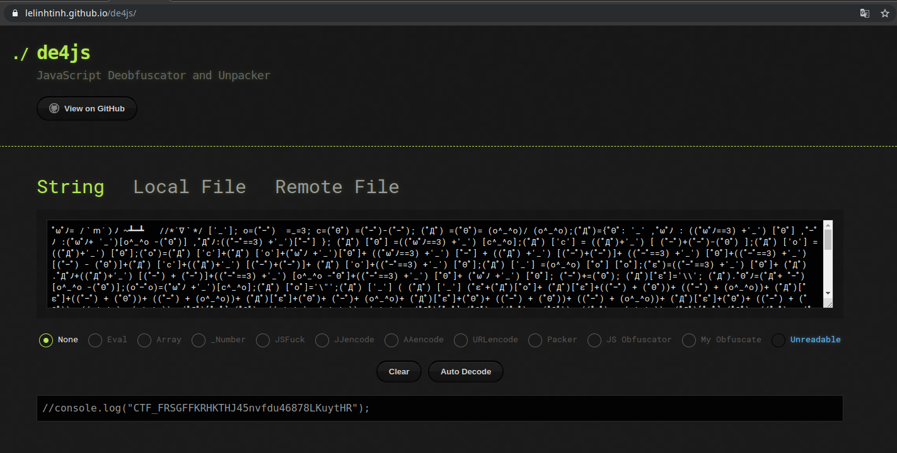

# Hackerlab2019 – JavaScript 1/2 ?

* **Category:** Web
* **Points:** 150

## Challenge

Après avoir pénétré la porte du couvent, les cyber-amazones sont confrontées à un language peu commun, qu'elles devront rapidement comprendre.<br> http://hackerlab.bj:8001/web04/web04_frgtrhtrh.html

## Solution
Le lien de cet épreuve nous a conduit vers une page vide. En faisant Ctrl+U pour afficher le code source de la page, nous avons remarqué qu’il y avait du code JavaScript qui était encoder (Javascript Obfuscator). On devait donc le désencoder  pour voir le contenu.
```html
<html>
<head>
<meta charset="UTF-8">
    <title>Javascript1/2</title>
    <script>
ﾟωﾟﾉ= /｀ｍ´）ﾉ ~┻━┻   //*´∇｀*/ ['_']; o=(ﾟｰﾟ)  =_=3; c=(ﾟΘﾟ) =(ﾟｰﾟ)-(ﾟｰﾟ); (ﾟДﾟ) =(ﾟΘﾟ)= (o^_^o)/ (o^_^o);(ﾟДﾟ)={ﾟΘﾟ: '_' ,ﾟωﾟﾉ : ((ﾟωﾟﾉ==3) +'_') [ﾟΘﾟ] ,ﾟｰﾟﾉ :(ﾟωﾟﾉ+ '_')[o^_^o -(ﾟΘﾟ)] ,ﾟДﾟﾉ:((ﾟｰﾟ==3) +'_')[ﾟｰﾟ] }; (ﾟДﾟ) [ﾟΘﾟ] =((ﾟωﾟﾉ==3) +'_') [c^_^o];(ﾟДﾟ) ['c'] = ((ﾟДﾟ)+'_') [ (ﾟｰﾟ)+(ﾟｰﾟ)-(ﾟΘﾟ) ];(ﾟДﾟ) ['o'] = ((ﾟДﾟ)+'_') [ﾟΘﾟ];(ﾟoﾟ)=(ﾟДﾟ) ['c']+(ﾟДﾟ) ['o']+(ﾟωﾟﾉ +'_')[ﾟΘﾟ]+ ((ﾟωﾟﾉ==3) +'_') [ﾟｰﾟ] + ((ﾟДﾟ) +'_') [(ﾟｰﾟ)+(ﾟｰﾟ)]+ ((ﾟｰﾟ==3) +'_') [ﾟΘﾟ]+((ﾟｰﾟ==3) +'_') [(ﾟｰﾟ) - (ﾟΘﾟ)]+(ﾟДﾟ) ['c']+((ﾟДﾟ)+'_') [(ﾟｰﾟ)+(ﾟｰﾟ)]+ (ﾟДﾟ) ['o']+((ﾟｰﾟ==3) +'_') [ﾟΘﾟ];(ﾟДﾟ) ['_'] =(o^_^o) [ﾟoﾟ] [ﾟoﾟ];(ﾟεﾟ)=((ﾟｰﾟ==3) +'_') [ﾟΘﾟ]+ (ﾟДﾟ) .ﾟДﾟﾉ+((ﾟДﾟ)+'_') [(ﾟｰﾟ) + (ﾟｰﾟ)]+((ﾟｰﾟ==3) +'_') [o^_^o -ﾟΘﾟ]+((ﾟｰﾟ==3) +'_') [ﾟΘﾟ]+ (ﾟωﾟﾉ +'_') [ﾟΘﾟ]; (ﾟｰﾟ)+=(ﾟΘﾟ); (ﾟДﾟ)[ﾟεﾟ]='\\'; (ﾟДﾟ).ﾟΘﾟﾉ=(ﾟДﾟ+ ﾟｰﾟ)[o^_^o -(ﾟΘﾟ)];(oﾟｰﾟo)=(ﾟωﾟﾉ +'_')[c^_^o];(ﾟДﾟ) [ﾟoﾟ]='\"';(ﾟДﾟ) ['_'] ( (ﾟДﾟ) ['_'] (ﾟεﾟ+(ﾟДﾟ)[ﾟoﾟ]+ (ﾟДﾟ)[ﾟεﾟ]+((ﾟｰﾟ) + (ﾟΘﾟ))+ ((ﾟｰﾟ) + (o^_^o))+ (ﾟДﾟ)[ﾟεﾟ]+((ﾟｰﾟ) + (ﾟΘﾟ))+ ((ﾟｰﾟ) + (o^_^o))+ (ﾟДﾟ)[ﾟεﾟ]+(ﾟΘﾟ)+ (ﾟｰﾟ)+ (o^_^o)+ (ﾟДﾟ)[ﾟεﾟ]+(ﾟΘﾟ)+ ((ﾟｰﾟ) + (ﾟΘﾟ))+ ((ﾟｰﾟ) + (o^_^o))+ (ﾟДﾟ)[ﾟεﾟ]+(ﾟΘﾟ)+ ((ﾟｰﾟ) + (ﾟΘﾟ))+ ((o^_^o) +(o^_^o))+ (ﾟДﾟ)[ﾟεﾟ]+(ﾟΘﾟ)+ ((o^_^o) +(o^_^o))+ (o^_^o)+ (ﾟДﾟ)[ﾟεﾟ]+(ﾟΘﾟ)+ ((ﾟｰﾟ) + (ﾟΘﾟ))+ ((ﾟｰﾟ) + (o^_^o))+ (ﾟДﾟ)[ﾟεﾟ]+(ﾟΘﾟ)+ ((ﾟｰﾟ) + (ﾟΘﾟ))+ (ﾟｰﾟ)+ (ﾟДﾟ)[ﾟεﾟ]+(ﾟΘﾟ)+ (ﾟｰﾟ)+ ((ﾟｰﾟ) + (ﾟΘﾟ))+ (ﾟДﾟ)[ﾟεﾟ]+((ﾟｰﾟ) + (ﾟΘﾟ))+ ((o^_^o) +(o^_^o))+ (ﾟДﾟ)[ﾟεﾟ]+(ﾟΘﾟ)+ ((ﾟｰﾟ) + (ﾟΘﾟ))+ (ﾟｰﾟ)+ (ﾟДﾟ)[ﾟεﾟ]+(ﾟΘﾟ)+ ((ﾟｰﾟ) + (ﾟΘﾟ))+ ((ﾟｰﾟ) + (o^_^o))+ (ﾟДﾟ)[ﾟεﾟ]+(ﾟΘﾟ)+ (ﾟｰﾟ)+ ((ﾟｰﾟ) + (o^_^o))+ (ﾟДﾟ)[ﾟεﾟ]+((ﾟｰﾟ) + (ﾟΘﾟ))+ (c^_^o)+ (ﾟДﾟ)[ﾟεﾟ]+(ﾟｰﾟ)+ ((o^_^o) - (ﾟΘﾟ))+ (ﾟДﾟ)[ﾟεﾟ]+(ﾟΘﾟ)+ (c^_^o)+ (o^_^o)+ (ﾟДﾟ)[ﾟεﾟ]+(ﾟΘﾟ)+ ((o^_^o) - (ﾟΘﾟ))+ (ﾟｰﾟ)+ (ﾟДﾟ)[ﾟεﾟ]+(ﾟΘﾟ)+ (c^_^o)+ ((o^_^o) +(o^_^o))+ (ﾟДﾟ)[ﾟεﾟ]+(ﾟΘﾟ)+ (o^_^o)+ ((ﾟｰﾟ) + (o^_^o))+ (ﾟДﾟ)[ﾟεﾟ]+(ﾟΘﾟ)+ (c^_^o)+ ((o^_^o) +(o^_^o))+ (ﾟДﾟ)[ﾟεﾟ]+(ﾟΘﾟ)+ ((o^_^o) - (ﾟΘﾟ))+ ((o^_^o) - (ﾟΘﾟ))+ (ﾟДﾟ)[ﾟεﾟ]+(ﾟΘﾟ)+ ((o^_^o) - (ﾟΘﾟ))+ (o^_^o)+ (ﾟДﾟ)[ﾟεﾟ]+(ﾟΘﾟ)+ (c^_^o)+ ((ﾟｰﾟ) + (o^_^o))+ (ﾟДﾟ)[ﾟεﾟ]+(ﾟΘﾟ)+ (c^_^o)+ ((o^_^o) +(o^_^o))+ (ﾟДﾟ)[ﾟεﾟ]+(ﾟΘﾟ)+ (c^_^o)+ ((o^_^o) +(o^_^o))+ (ﾟДﾟ)[ﾟεﾟ]+(ﾟΘﾟ)+ (ﾟΘﾟ)+ (o^_^o)+ (ﾟДﾟ)[ﾟεﾟ]+(ﾟΘﾟ)+ ((o^_^o) - (ﾟΘﾟ))+ ((o^_^o) - (ﾟΘﾟ))+ (ﾟДﾟ)[ﾟεﾟ]+(ﾟΘﾟ)+ (ﾟΘﾟ)+ (c^_^o)+ (ﾟДﾟ)[ﾟεﾟ]+(ﾟΘﾟ)+ (ﾟΘﾟ)+ (o^_^o)+ (ﾟДﾟ)[ﾟεﾟ]+(ﾟΘﾟ)+ ((o^_^o) - (ﾟΘﾟ))+ (ﾟｰﾟ)+ (ﾟДﾟ)[ﾟεﾟ]+(ﾟΘﾟ)+ (ﾟΘﾟ)+ (c^_^o)+ (ﾟДﾟ)[ﾟεﾟ]+(ﾟΘﾟ)+ (ﾟΘﾟ)+ ((o^_^o) - (ﾟΘﾟ))+ (ﾟДﾟ)[ﾟεﾟ]+((o^_^o) +(o^_^o))+ (ﾟｰﾟ)+ (ﾟДﾟ)[ﾟεﾟ]+((o^_^o) +(o^_^o))+ ((ﾟｰﾟ) + (ﾟΘﾟ))+ (ﾟДﾟ)[ﾟεﾟ]+(ﾟΘﾟ)+ ((ﾟｰﾟ) + (ﾟΘﾟ))+ ((o^_^o) +(o^_^o))+ (ﾟДﾟ)[ﾟεﾟ]+(ﾟΘﾟ)+ ((o^_^o) +(o^_^o))+ ((o^_^o) +(o^_^o))+ (ﾟДﾟ)[ﾟεﾟ]+(ﾟΘﾟ)+ (ﾟｰﾟ)+ ((o^_^o) +(o^_^o))+ (ﾟДﾟ)[ﾟεﾟ]+(ﾟΘﾟ)+ (ﾟｰﾟ)+ (ﾟｰﾟ)+ (ﾟДﾟ)[ﾟεﾟ]+(ﾟΘﾟ)+ ((o^_^o) +(o^_^o))+ ((ﾟｰﾟ) + (ﾟΘﾟ))+ (ﾟДﾟ)[ﾟεﾟ]+((o^_^o) +(o^_^o))+ (ﾟｰﾟ)+ (ﾟДﾟ)[ﾟεﾟ]+((o^_^o) +(o^_^o))+ ((o^_^o) +(o^_^o))+ (ﾟДﾟ)[ﾟεﾟ]+((ﾟｰﾟ) + (o^_^o))+ (c^_^o)+ (ﾟДﾟ)[ﾟεﾟ]+((o^_^o) +(o^_^o))+ ((ﾟｰﾟ) + (o^_^o))+ (ﾟДﾟ)[ﾟεﾟ]+((ﾟｰﾟ) + (o^_^o))+ (c^_^o)+ (ﾟДﾟ)[ﾟεﾟ]+(ﾟΘﾟ)+ (ﾟΘﾟ)+ (ﾟｰﾟ)+ (ﾟДﾟ)[ﾟεﾟ]+(ﾟΘﾟ)+ (ﾟΘﾟ)+ (o^_^o)+ (ﾟДﾟ)[ﾟεﾟ]+(ﾟΘﾟ)+ ((o^_^o) +(o^_^o))+ ((ﾟｰﾟ) + (ﾟΘﾟ))+ (ﾟДﾟ)[ﾟεﾟ]+(ﾟΘﾟ)+ ((ﾟｰﾟ) + (o^_^o))+ (ﾟΘﾟ)+ (ﾟДﾟ)[ﾟεﾟ]+(ﾟΘﾟ)+ ((o^_^o) +(o^_^o))+ (ﾟｰﾟ)+ (ﾟДﾟ)[ﾟεﾟ]+(ﾟΘﾟ)+ (ﾟΘﾟ)+ (c^_^o)+ (ﾟДﾟ)[ﾟεﾟ]+(ﾟΘﾟ)+ ((o^_^o) - (ﾟΘﾟ))+ ((o^_^o) - (ﾟΘﾟ))+ (ﾟДﾟ)[ﾟεﾟ]+(ﾟｰﾟ)+ ((o^_^o) - (ﾟΘﾟ))+ (ﾟДﾟ)[ﾟεﾟ]+((ﾟｰﾟ) + (ﾟΘﾟ))+ (ﾟΘﾟ)+ (ﾟДﾟ)[ﾟεﾟ]+((ﾟｰﾟ) + (o^_^o))+ (o^_^o)+ (ﾟДﾟ)[ﾟoﾟ]) (ﾟΘﾟ)) ('_');
    </script>
</head>

</html>
```
Pour ce faire, nous avons utilisé l’outil en ligne : [de4js](https://lelinhtinh.github.io/de4js/). En allant sur ce site, nous avons collé le code brouiller dans le champ texte et on a cliquer sur Auto decode.



Le flag pour cet épreuve était donc : ```CTF_FRSGFFKRHKTHJ45nvfdu46878LKuytHR```
