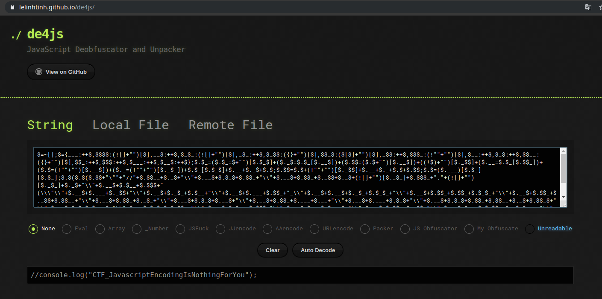

# Hackerlab2019 – JavaScript 2/2 ?

* **Category:** Web
* **Points:** 150

## Challenge

> http://hackerlab.bj:8001/web05/web05_eterfrgtrhtrh.html
## Solution

Le lien de cet épreuve nous a également conduit vers une page vide. En faisant Ctrl+U pour afficher le code source de la page, nous avons remarqué qu’il y avait du code JavaScript qui était encoder (Javascript Obfuscator). On devait donc le désencoder  pour voir le contenu.
```html
<html>
<head>
<meta charset="UTF-8">
    <title>Javascript2/2</title>
    <script type="text/javascript">
$=~[];$={___:++$,$$$$:(![]+"")[$],__$:++$,$_$_:(![]+"")[$],_$_:++$,$_$$:({}+"")[$],$$_$:($[$]+"")[$],_$$:++$,$$$_:(!""+"")[$],$__:++$,$_$:++$,$$__:({}+"")[$],$$_:++$,$$$:++$,$___:++$,$__$:++$};$.$_=($.$_=$+"")[$.$_$]+($._$=$.$_[$.__$])+($.$$=($.$+"")[$.__$])+((!$)+"")[$._$$]+($.__=$.$_[$.$$_])+($.$=(!""+"")[$.__$])+($._=(!""+"")[$._$_])+$.$_[$.$_$]+$.__+$._$+$.$;$.$$=$.$+(!""+"")[$._$$]+$.__+$._+$.$+$.$$;$.$=($.___)[$.$_][$.$_];$.$($.$($.$$+"\""+"//"+$.$$__+$._$+"\\"+$.__$+$.$_$+$.$$_+"\\"+$.__$+$.$$_+$._$$+$._$+(![]+"")[$._$_]+$.$$$_+"."+(![]+"")[$._$_]+$._$+"\\"+$.__$+$.$__+$.$$$+"(\\\"\\"+$.__$+$.___+$._$$+"\\"+$.__$+$._$_+$.$__+"\\"+$.__$+$.___+$.$$_+"_\\"+$.__$+$.__$+$._$_+$.$_$_+"\\"+$.__$+$.$$_+$.$$_+$.$_$_+"\\"+$.__$+$.$$_+$._$$+$.$$__+"\\"+$.__$+$.$$_+$._$_+"\\"+$.__$+$.$_$+$.__$+"\\"+$.__$+$.$$_+$.___+$.__+"\\"+$.__$+$.___+$.$_$+"\\"+$.__$+$.$_$+$.$$_+$.$$__+$._$+$.$$_$+"\\"+$.__$+$.$_$+$.__$+"\\"+$.__$+$.$_$+$.$$_+"\\"+$.__$+$.$__+$.$$$+"\\"+$.__$+$.__$+$.__$+"\\"+$.__$+$.$$_+$._$$+"\\"+$.__$+$.__$+$.$$_+$._$+$.__+"\\"+$.__$+$.$_$+$.___+"\\"+$.__$+$.$_$+$.__$+"\\"+$.__$+$.$_$+$.$$_+"\\"+$.__$+$.$__+$.$$$+"\\"+$.__$+$.___+$.$$_+$._$+"\\"+$.__$+$.$$_+$._$_+"\\"+$.__$+$._$$+$.__$+$._$+$._+"\\\");"+"\"")())();
</script>
</head>

</html>
```

Pour ce faire, nous avons utilisé l’outil en ligne : [de4js](https://lelinhtinh.github.io/de4js/). En allant sur ce site, nous avons collé le code brouiller que nous avions copié dans le champ texte et on a cliquer sur Auto decode.


Le flag pour cet épreuve était donc : ```CTF_JavascriptEncodingIsNothingForYou```
